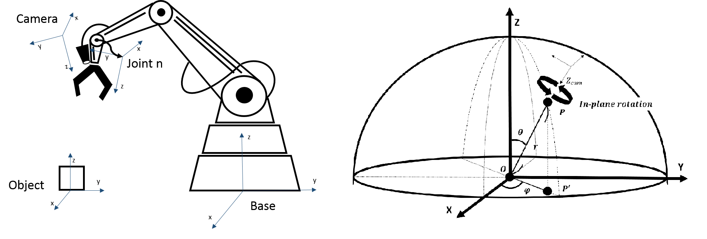
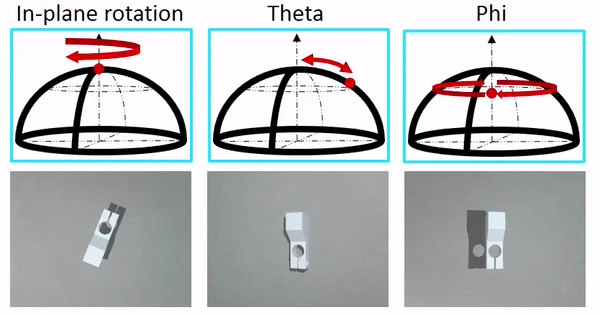
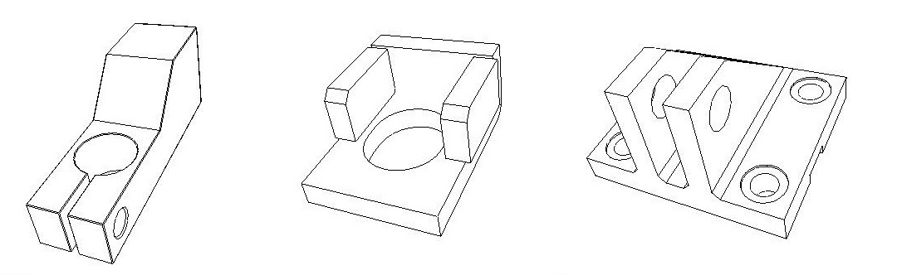

# Training Deep Networks with Synthetic Data for Textureless Object Pose Estimation
碩士研究成果，不過目前因其他因素，無法公開全文，也不適合作太詳細的說明，還請見諒
最晚公開時間 2025.01
## 論文連結
https://drive.google.com/open?id=14RATn-h3gV4wIrBbZ2rxjERyxK64EEQM
## 簡述
### 問題定義
　　在這個研究中想要解決在工業應用上因傳統視覺伺服的不足而導入深度學習時，所發生的種種問題。
我們假設視覺系統為一個手眼系統(左圖)，所以能夠以物體為圓心定義出一個球座標系(右圖)

　　根據此座標系，在我們的研究中主要考慮三個變量 : In-plane Rotation 、 Theta 、 Phi

### CAD Simulator
　　同時為了解決訓練資料取得及標定不易的問題，我們撰寫了使用OpenGL並在QT上進行開發的CAD模型模擬器，詳細可以前往我的 CAD-Simulator 專案(https://github.com/Nineko/CAD-Simulator)
  

### 測試結果
　　在本研究中，我們利用前述的模擬器產生訓練資料進行訓練，並以相同的方式產生測試集對三種物體進行測試，每種物體都產生了約16000張圖片進行測試
 

　　測試時分成兩個部分，首先為分辨物體及物體定位的結果 :
| Class   | Mean IoU | Mean Classification Accuracy | Center X-Shift Error (By pixel) | Center Y-Shift Error (By pixel) |
| :-----: | :------: | :--------------------------: | :-----------------------------: | :-----------------------------: |
| Class 1 | 0.8824   | 0.8284                       | 2.3140                          | 2.2287                          |
| Class 2 | 0.8592   | 0.8496                       | 1.6883                          | 1.6435                          |
| Class 3 | 0.9362   | 0.8499                       | 1.9301                          | 1.6057                          |

　　再來是三個變量的估測結果 :
| Class   | Mean In-plane rotation error(°)  | Mean Theta error(°) | Mean Phi error(°) | 
| :-----: | :------------------------------: | :-----------------: | :---------------: |
| Class 1 | 2.7461                           | 1.3171              | 6.2603            |
| Class 2 | 3.5969                           | 0.8520              | 6.2455            |
| Class 3 | 4.6340                           | 1.0070              | 6.0381            |
